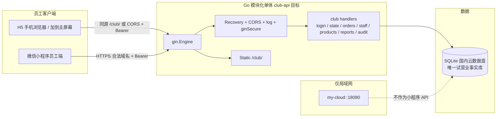
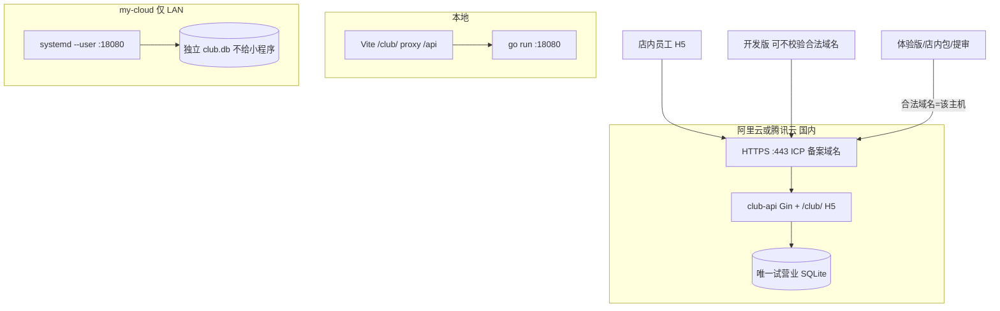

# HOLE CLUB 技术架构文档（当前实现 + 多端前端）

| 字段 | 内容 |
| --- | --- |
| 文档标题 | HOLE CLUB 技术架构：当前实现与多端前端 |
| 作者 | HOLE CLUB 工程组 |
| 日期 | 2026-09-14 |
| 状态 | Approved-with-decisions |
| 适用范围 | 单门店试营业 → 正式营业前；员工端 H5 / 微信小程序 |
| 关联文档 | [README.md](../README.md)、[UI 产品需求文档](./UI_PRODUCT_PRD.md)、[测试部署说明](./TEST_DEPLOYMENT.md) |

> **现状：后端已是 Gin 1.10。** `server/go.mod` 依赖 `github.com/gin-gonic/gin`；进程用 `gin.Engine` 注册健康检查、`/api/v1` 分组、鉴权中间件和 `/club/` 静态资源。`clubStore`、订单状态机和 SQLite 未改。

本文是员工端多端与部署的现行架构说明。旧问答稿 `ARCHITECTURE_TECH_STACK_QA.md` 已从仓库移除；产品目标仍对齐 [UI PRD](./UI_PRODUCT_PRD.md)：员工移动端优先。顾客会员端本阶段不做。

---

## Overview

HOLE CLUB 是单门店夜店订台与现场运营系统。员工用销售 / 前台 / 服务员 / 店长四种角色，完成「登录 → 工作台 / 台位 → 两步预订 → 到店 → 开台 → 加单 → 登记线下收款 → 清台」闭环；店长可部分退款、管员工、管商品、看报表与审计。服务端是业务事实来源。

当前实现是模块化单体：一个 Go 进程提供 REST JSON API 并托管静态 H5（`/club/`），业务数据在 **SQLite**，会话是 opaque Bearer token。前端是 UniApp + Vue 3，目前只注册员工工作台 H5。已决议：把 HTTP 层迁到 Gin；同一套 UniApp 交付微信小程序员工端；试营业 H5 与小程序打**同一国内云 HTTPS + 同一份 SQLite**。不使用 Railway，不使用 GitHub Pages。

---

## Background & Motivation

### 当前仓库实际技术栈（2026-09-14 核对）

| 层级 | 现状 | 已决议目标 | 证据 |
| --- | --- | --- | --- |
| 后端 HTTP | Go 1.23 `net/http` ServeMux | **Gin**（完整迁移，非 Wrap） | `server/cmd/api/main.go`；`go.mod` 无 gin |
| 后端依赖 | sqlite、mysql 驱动、x/crypto | 增加 `github.com/gin-gonic/gin` | `server/go.mod` |
| 业务库 | SQLite `CLUB_DB_PATH` | 不变 | `newClubStore()` in `club.go` |
| MySQL | 仅 `/readyz` 可选探测 | 仍非订单库 | `application.ready()` |
| 鉴权 | `sessions` + bcrypt + Bearer | 不变，PIN 登录 | `app.secure()` |
| 前端 | UniApp Vue3，只注册 console | 同一工程加 mp-weixin | `front/src/pages.json` |
| 请求层 | `uni.request`，相对 `/api/v1` | `apiBase()` + 401 契约 | `front/src/services/api.ts` |
| 部署 | `Dockerfile`、`railway.toml`、my-cloud systemd、GitHub Pages workflow | **删除 Railway 与 Pages**；API 上阿里云或腾讯云国内 HTTPS；my-cloud `:18080` 仅局域网 H5 | 根目录上述文件 |

### 痛点

1. README 已写 Gin，代码仍是 `net/http`。
2. 前端具备小程序脚本但只跑 H5；`api.ts` 相对 URL 在微信里不可用。
3. 仓库仍带 `railway.toml` 与 Pages workflow，与「国内 ICP HTTPS、不要 Pages」的决议冲突。
4. `request()` 任意 401 会递归 `logout()`。

### 规模假设

单门店；50–100 员工账号；20–50 并发客户端；读 20–50 QPS；写 5–10 QPS。模块化单体，不上 Redis，除非以后多实例共享会话。

---

## Goals & Non-Goals

### Goals

- HTTP 层迁到 Gin：路由、CORS、日志、`secure`、handler 改为 `gin.Context`。**不重写** `clubStore` / `writeOrder` / `priced()` / 状态机。
- 员工端多端：P0 H5 + 微信小程序（同一 UniApp、v1 不拆 `ClubConsole` 多页）。
- 试营业：H5 与小程序共用阿里云或腾讯云上的 **同一 HTTPS 主机、同一 SQLite**。
- 从仓库拿掉 Railway 与 GitHub Pages 作为架构目标。
- 增量 PR，H5 Playwright 保持绿灯。

### Non-Goals

- 不引入 JWT、Pinia、sqlc、Redis、微服务（若出现必须标目标态）。
- 不把 `pages/index` 等 localStorage 演示页重新注册。
- 本阶段不做顾客会员端、线上支付、库存、排班、跨门店。
- 不把 `ClubConsole` 拆成多页（v1）。
- 不在 my-cloud `deploy` 用户下装系统 Nginx 或绑 :443。
- 不把员工 token key 从 `club-test-session` 改名。
- 不为 `apiBase()` 引入 Vitest。
- 不把备案域 CNAME 到海外。
- 不新开 Flutter / RN / 原生仓。
- App（`uni-app-plus` 脚本）本阶段不排期。

---

## Key Decisions

1. **HTTP 层改写成 Gin，不是 Wrap，也不是继续 `net/http`。**  
   现状仍是 ServeMux。目标：`gin.Engine` 注册全部现有路由，中间件改为 Gin 链（Recovery、CORS、访问日志、Bearer `secure`），handler 使用 `*gin.Context`。`clubStore`、SQLite 事务、`writeOrder`、幂等、`priced()`、会话表保持。测试继续用 `httptest` 打 `Engine.ServeHTTP`。多端后续 PR 落在 Gin 上，不再给 ServeMux 加功能。

2. **鉴权保持服务端会话 token + PIN，不改 JWT；401 只清本地，禁止经 `request()` 递归登出。**  
   12 小时过期、登出删除、停用/改口令立即失效。V1 登录继续员工账号 + 口令，不用 `wx.login` 当权限。401 契约见下文。

3. **一个 UniApp 工程做员工 H5 + 微信小程序；v1 不拆页、不做 Flutter。**  
   第一个额外客户端就是员工小程序。`ClubConsole.vue` 继续作为唯一注册页。

4. **同一 REST `/api/v1` 服务员工 H5 与小程序。**  
   不为小程序另起 BFF 或 GraphQL。

5. **SQLite 继续作为事实库；试营业只有一份库，在国内云上。**  
   MySQL 仍是后续迁移。`MYSQL_DSN` 不是订单库。

6. **员工 token storage key 冻结为 `club-test-session`。**  
   顾客端本阶段不做，因此不引入第二套 key。禁止在 `ClubConsole` 里加会员入口。

7. **旧演示页冻结，不删除源码、不注册路由。**

8. **小程序登录仍是员工账号 + 口令。** 提审仍要隐私指引；不用 `wx.getPhoneNumber`。

9. **唯一对外 API：阿里云或腾讯云国内 ICP 备案 HTTPS。删除 Railway 与 GitHub Pages。**  
   开发版带来期间可「不校验合法域名」打该主机；体验版 / 店内包 / 提审必须把该主机配进 request 合法域名（按微信后台当前格式，无端口、无路径）。my-cloud `:18080` 只做局域网 H5，不是小程序 API。不要 CNAME 到海外。Dockerfile 保留为国内云容器/轻量部署产物，删除 `railway.toml` 作为发布路径。

---

## 已决议

| # | 原问题 | 决议 |
| --- | --- | --- |
| 1 | 后端是否 Gin | **必须重写成 Gin**（路由+中间件+handler，保留业务存储） |
| 2 | 第一个额外客户端 | **微信小程序员工端**，同一 UniApp |
| 3 | 体验版 HTTPS | **阿里云或腾讯云国内 HTTPS**，不要 my-cloud root/Caddy，不要 CNAME 海外 |
| 4 | Pages / Railway | **不需要 GitHub Pages；架构中删除所有 Railway** |
| 5 | 是否拆 ClubConsole | **v1 不拆页** |
| 6 | 登录 | **V1 继续 PIN** |
| 7 | 顾客会员端 | **先不做，不排期** |
| 8 | 是否共用库 | **试营业 H5 + 小程序打同一国内 API、同一 SQLite** |

仍待补的输入见文末「Open Questions」（仅厂商二选一与微信主体）。

---

## Proposed Design

### 1. 系统全景



### 2. 后端 HTTP 层：现状 `net/http` → 目标 Gin

#### 现状

`server/cmd/api/main.go`：`http.NewServeMux()`，中间件 `app.cors(app.logRequest(mux))`，超时与优雅退出不变。业务路由在 `registerClub`（`club.go`）。

| 方法 | 路径 | 鉴权 | Handler |
| --- | --- | --- | --- |
| POST | `/api/v1/login` | 无 | `login` |
| GET | `/api/v1/login-options` | 无 | `loginOptions` |
| POST | `/api/v1/logout` | `secure` | `logout` |
| GET | `/api/v1/state` | `secure` | `state` |
| GET | `/api/v1/audit-logs` | `secure` + `audit:view` | `auditLogs` |
| GET/POST | `/api/v1/staff` | `secure` + `staff:manage` | `listStaff` / `createStaff` |
| PUT | `/api/v1/staff/{id}` | `secure` + `staff:manage` | `updateStaff` |
| GET | `/api/v1/reports/daily` | `secure` + `report:view` 或 `report:own` | `dailyReport` |
| GET/POST | `/api/v1/products` | `secure` + `requireOwner`（实际 `staff:manage`） | `listProducts` / `createProduct` |
| PUT | `/api/v1/products/{id}` | 同上 | `updateProduct` |
| POST | `/api/v1/orders` | `secure` + `order:create` | `createBooking` |
| GET | `/api/v1/orders` | `secure` | `listOrders` |
| POST | `/api/v1/orders/{id}/{action}` | `secure` + 动作权限 | `mutateOrder` |

动作：`update-booking`、`confirm-arrival`、`open-table`、`change-table`、`cancel`、`items`、`checkout`、`complete-cleaning`、`refund`。禁止 `PATCH status`。

`requireOwner()` 检查 `staff:manage`。服务端没有 `product:manage` 字符串；前端 `can('product:manage')` 仅因店长是 `*`。

#### 目标：完整 Gin 迁移（PR-2，尽早合入）

不是 `gin.WrapF`。约定：

```go
func (app *application) routes() http.Handler {
    gin.SetMode(gin.ReleaseMode)
    r := gin.New()
    r.Use(gin.Recovery(), app.ginCORS(), app.ginLog())
    r.GET("/healthz", app.health)
    r.GET("/readyz", app.ready)
    r.GET("/api/v1/meta", app.meta)
    r.POST("/api/v1/login", app.login)
    r.GET("/api/v1/login-options", app.loginOptions)
    auth := r.Group("/api/v1")
    auth.Use(app.ginSecure())
    auth.GET("/state", app.state)
    auth.POST("/orders/:id/:action", app.mutateOrder)
    // …其余与上表一一对应
    web := env("CLUB_WEB_DIR", "web")
    r.Static("/club", web)
    r.GET("/", func(c *gin.Context) { c.Redirect(http.StatusTemporaryRedirect, "/club/") })
    return r
}
```

映射规则：

| 现状 | Gin |
| --- | --- |
| `http.ResponseWriter, *http.Request` | `*gin.Context` |
| `r.PathValue("id")` | `c.Param("id")` |
| `writeJSON` / `fail` | `c.JSON`；错误体仍 `{"error":"..."}` |
| `app.secure` 包一层 HandlerFunc | `gin.HandlerFunc`，`c.Set("staff", profile)` |
| `decode()` 读 Body | 登录/员工/商品可继续用现有 decode 或 `ShouldBindJSON`；**`writeOrder` 仍按 raw body + SHA-256 指纹**，不得改成会丢掉原始字节的 Bind |
| CORS Allow-Headers | `Authorization, Content-Type, Idempotency-Key` |
| `http.Server{Handler: app.routes()}` | 保持，Handler 换成 Engine |
| `club_test.go` 的 `httptest` | `Engine.ServeHTTP`，行为零差 |

保留：`clubStore`、WAL、会话、幂等表、`priced()`、乐观锁 `version`、角色表。禁止借迁 Gin 改状态机或拆 MySQL。

进程超时与 Shutdown 10s 保持。`gin.Recovery()` 替代裸 panic。

### 3. 鉴权、权限、会话

Token 是 `randomID()`：**24 字节 CSPRNG，hex 48 字符**，存在 SQLite，不是 JWT。`secure` 去掉 `Bearer ` 后查 `sessions`。登录 1 分钟 30 次 → 429。停用/改口令 `DELETE FROM sessions WHERE user_id=?`。

| 角色 | 服务端权限 |
| --- | --- |
| sales | `order:create` `order:update-own` `order:cancel-own` `report:own` |
| frontdesk | `order:create` `order:update` `order:confirm-arrival` `order:change-table` `order:cancel` |
| waiter | `order:confirm-arrival` `table:open` `order:add-item` `payment:checkout` `table:clean` |
| owner | `*` |

销售读路径用 `created_by = u.ID` 隔离。不要改成 Cookie。

### 4. 写路径

`writeOrder` 不变：Idempotency-Key 8–128；指纹 SHA-256(path+raw body)；进程锁 + 事务；时段重叠；`priced()` 服务端定价；version 冲突 409。弱网非 4xx 必须复用同一 key（Playwright 已覆盖加单丢响应）。

```text
reserved --confirm-arrival--> arrived --open-table--> serving --checkout--> cleaning --complete-cleaning--> completed
    +--cancel--> cancelled     refund 可在 cleaning/completed
```

### 5. 前端：H5 + 微信小程序（单页 ClubConsole）

`pages.json` 只注册 `pages/console/index`。v1 **不**拆 tables/orders/booking/mine。旧 `services/orders.ts` 禁止接回。App 脚本未接，本阶段不排。

`apiBase()`：H5 同源可空（国内云托管 `/club/` 时）；小程序必须 `https://`，否则模块加载 throw。CI `build:mp-weixin` 缺 `VITE_API_BASE` 失败。不要 Vitest。

#### 401 / logout 契约

| 请求 | 401 时 | 禁止 |
| --- | --- | --- |
| `POST /login` | 只 reject，不动 storage | `logout()` / `removeStorageSync` |
| `POST /logout` | 清本地，忽略 401 | 再进 `request()` |
| 其它 `/api/v1/*` | 只 `removeStorageSync` 后 reject | 调用 `logout()` |
| 用户点退出 | best-effort POST `/logout`，finally 清本地 | — |

过期 token 的 `GET /state` 不得打出 `/logout` 风暴（Playwright 或 Go 断言）。

| 能力 | H5（国内云同源 `/club/` 或 Vite 代理） | 微信小程序 |
| --- | --- | --- |
| URL | 相对 `/api/v1` 或同一 `VITE_API_BASE` | `https://<国内ICP主机>/api/v1…` |
| CORS | 同源不触发；独立 H5 域名需 Allow-Headers 含 `Idempotency-Key` | 无 CORS。开发版可暂不校验合法域名；体验版必须已备案 |
| 鉴权 | Bearer | Bearer，不要 Cookie |
| 存储 | `uni.setStorageSync` | 同左 |

`CORS_ALLOWED_ORIGINS` 默认去掉 `https://zhoujie0420.github.io`，保留本地 Vite；生产只加国内 H5 源（若 H5 不同源）。不加 `*`。

#### 微信 chrome（v1 必须）

- 轮询：`uni.onAppShow/Hide`，禁止后台空转。
- 胶囊：`getMenuButtonBoundingClientRect` + 状态栏；`HC` 头像避开胶囊。
- 去掉台位 overlay `@click.self`，独立 mask。
- `App.vue` 的 `html,body,#app,uni-page-body`（含 480px）`#ifdef H5`。
- MP tabbar 全宽。
- SVG tab 提供 png 后备。
- 键盘不遮挡登录口令 / 手机号错误文案。

`manifest.json` 无 `h5.router.base`；H5 base 仅 Vite `base: "/club/"`。需要时再新增且必须相同。`urlCheck`：开发版 false；体验版/提审 true。

```text
VITE_API_BASE=https://<阿里云或腾讯云ICP主机>
```

后端：`PORT` `APP_VERSION` `CLUB_DB_PATH` `CLUB_WEB_DIR` `CLUB_ACCESS_CODE` `CORS_ALLOWED_ORIGINS`；`MYSQL_DSN` 仍可选非订单库。无 `JWT_SIGNING_KEY`。

### 6. 运行时数据流

营业日：上海时区减 6 小时（06:00 切日）。`GET /state?rev=` 无变更只回 `unchanged`。跨设备靠服务端。

### 7. 部署拓扑



| 客户端 | API | 数据 |
| --- | --- | --- |
| 本地 Vite | `127.0.0.1:18080` | 开发库 |
| my-cloud H5 | `:18080` HTTP | **局域网独立库**，不是小程序事实源 |
| 员工 H5 试营业、小程序开发版/体验版/正式版 | **同一** `https://<ICP国内主机>` | **同一** 国内云 SQLite |

微信 request 合法域名：按后台当前格式（常见 `https://host`），无端口无路径，必须已备案。Docker 镜像可部署到该云的容器/轻量；证书用云厂商或负载均衡。仓库不提交私钥。删除 `railway.toml` 与 Pages 作为发布手段。

---

## API / Interface Changes

契约不变：`/api/v1` JSON；成功直接对象；失败 `{"error":"…"}`；写订单要 Idempotency-Key；变更带 `version`；Bearer。

小改：CORS 头加 `Idempotency-Key`；`login-options` 保持公开；不改 Cookie；健康检查匿名。

本阶段不做：JWT refresh、`/api/v1/customer/*`、`PATCH` 状态、金额改「分」。

Gin 迁移不得改变上述 JSON 形状，否则 H5 全坏。

---

## Data Model Changes

本阶段 **无 schema 变更**。表仍是 `orders`（含 JSON `body`）、`requests`、`sessions`、`audit_logs`、`staff_accounts`、`products`、`meta`。18 个台位仍硬编码。

MySQL 仍是后续；不要为国内云先挂空 MySQL 当订单库。备份：国内云数据盘每日 `.backup` + 恢复演练；启动时 `DELETE FROM sessions WHERE expires < ?`。`requests` 暂不改表。

---

## Alternatives Considered

### A. HTTP 层迁到 Gin（**已采纳**）

- **方案：** handler 改为 `gin.Context`，中间件与路由全迁；保留 `clubStore`。
- **未采纳：** 继续 ServeMux；`gin.WrapF` 只包一层。
- **约束：** 幂等仍按原始 Body 指纹；`club_test.go` 行为零差后再合入多端功能。

### B. 原生 WXML 重写员工端 — 拒绝（UniApp 已在仓库）。

### C. 小程序 web-view 套 H5 — 仅应急，非正式架构。

### D. 一次上齐 MySQL + sqlc + JWT + Pinia — 拒绝大爆炸。JWT 与即时撤会话冲突。

### E. Cookie 替代 Bearer — 拒绝（小程序不适合）。

### F. Flutter / 独立原生仓 — 拒绝（会分叉状态机与 Playwright）。

### G. Railway + GitHub Pages — **已否决**。Pages 无 API；Railway 海外域不能做微信合法域名。

### H. my-cloud root 绑 :443 给小程序 — **已否决**。`deploy` 无权限；小程序 API 走阿里云/腾讯云。

---

## Security & Privacy Considerations

| 风险 | 缓解 |
| --- | --- |
| 测试口令 `holeclub` | 生产重置独立 PIN |
| 手机号明文 | 测试只用虚构号；正式前再加密 |
| 401 递归 logout | PR-4 契约 |
| CORS 过宽 | 去掉 github.io；生产只列需要的 H5 origin |
| 口令进客户端代码 | 禁止 |
| `wx.login` 当权限 | 禁止 |
| 无隐私指引提审失败 | 指引 + 用途文案 + 政策 URL（挂国内云 `/club/` 或同域静态页） |
| SQLite 文件权限 | 600；备份同样 |

隐私：手填姓名与 11 位手机号仍要「用户隐私保护指引」。不用 `wx.getPhoneNumber`。不收集身份证/位置/相册。不接微信支付。

---

## Observability

现状：`logRequest` 无 status。Gin 迁移时用中间件记录 `method, path, status, duration_ms`（可 slog JSON）。禁止打 token、口令、完整手机号。`/healthz` `/readyz` 保留。告警：readyz 失败、5xx、库文件暴涨（先清过期 session）。

---

## Rollout Plan

1. 先合 Gin 迁移；H5 Playwright + `go test` 全绿。
2. 删 Railway / Pages 配置与文档表述。
3. 国内云 HTTPS 上同一 `club-api`（含 `/club/` H5）+ 数据盘 SQLite。开发版可不校验合法域名先联调。
4. 前端 `VITE_API_BASE` 指向该主机；401 契约与 chrome 补丁随小程序构建。
5. 体验版 / 店内包：合法域名 + 隐私指引 + `urlCheck: true`。H5 与小程序打同一 API。
6. 小程序失败不阻断局域网 my-cloud H5。
7. 回滚：国内云回上一镜像/二进制；SQLite 只做向前兼容 ALTER。

---

## 多端落地清单

### 后端

- [ ] Gin 完整迁移，测试行为一致
- [ ] CORS Allow-Headers 含 `Idempotency-Key`
- [ ] 删除 `railway.toml`；README / 测试文档去掉 Railway 与 GitHub Pages 作为架构目标
- [ ] 阿里云或腾讯云国内 HTTPS + 数据盘 SQLite + 可选托管 `/club/` H5

### 前端

- [ ] `apiBase()` 失败即停；小程序 `VITE_API_BASE=https://<国内主机>`
- [ ] 401 契约；token key 冻结 `club-test-session`
- [ ] ClubConsole chrome / 轮询 / mask / H5 ifdef；**不拆页**
- [ ] 隐私指引与用途文案
- [ ] Playwright 仍只跑 H5

### 不要做

- [ ] 不要 `wx.login` / 微信支付 / `wx.getPhoneNumber`
- [ ] 不要接回 `orders.ts`
- [ ] 不要 JWT / Pinia / Flutter / 顾客端本阶段
- [ ] 不要 Vitest；不要 my-cloud :443；不要 Railway；不要 Pages

---

## Open Questions

1. **阿里云还是腾讯云？** 体验版合法域名用哪家国内地域、哪款产品（轻量 / ECS+LB / 容器）。选定前 PR-7 不能封板，但 Dockerfile 与二进制形态可先准备。
2. **微信小程序 AppID / 主体 / 类目？** `manifest.json` 仍为空。没有 AppID 不能真机；提审还要主体资质与隐私指引。

---

## References

- 代码：`server/cmd/api/main.go`、`server/cmd/api/club.go`、`server/cmd/api/club_test.go`、`server/go.mod`
- 前端：`front/src/services/api.ts`、`front/src/components/ClubConsole.vue`、`front/src/pages.json`、`front/src/manifest.json`、`front/vite.config.ts`
- 产品：[UI PRD](./UI_PRODUCT_PRD.md)
- 局域网测试：[测试部署说明](./TEST_DEPLOYMENT.md)、`deploy/club-test.service`
- 容器：`Dockerfile`（国内云用；**不要**再把 `railway.toml` 当发布入口）

`TEST_DEPLOYMENT.md` 中「分页、退款尚未实现」已过时。README 仍含 Pages / Railway 段落，由 PR-3 删除。

---

## PR Plan

每条可独立合并。**Gin 迁移尽早合入**，多端功能不要再扩 ServeMux。H5 Playwright 必须保持绿灯。

### PR-1：CORS 允许 `Idempotency-Key`

- **标题：** `fix(api): allow Idempotency-Key on CORS preflight`
- **影响文件：** `server/cmd/api/main.go`、`main_test.go`
- **依赖：** 无（若与 PR-2 重叠可并入 Gin PR）
- **说明：** Allow-Headers 加上该键。默认 origin **去掉 github.io**。

### PR-2：Gin 路由与中间件完整迁移

- **标题：** `refactor(api): migrate HTTP layer from ServeMux to Gin`
- **影响文件：** `server/go.mod`、`server/cmd/api/main.go`、`club.go`、`club_test.go`、`main_test.go`
- **依赖：** 无；建议先于或并入 PR-1
- **说明：** 引入 `github.com/gin-gonic/gin`。全部路由与 `secure`/CORS/日志改为 Gin。handler 改 `*gin.Context`。**保留** `clubStore`、`writeOrder` 原始 Body 指纹、`priced()`、会话。禁止 WrapF 敷衍。`go test ./...` 与现有用例零行为差后再合。多端后续只改 Gin。

### PR-3：删除 Railway 与 GitHub Pages 架构入口

- **标题：** `chore: remove Railway and GitHub Pages from deploy story`
- **影响文件：** 删除或停用 `railway.toml`、`.github/workflows/deploy-pages.yml`（若不再发布 Pages）；`README.md`、`docs/TEST_DEPLOYMENT.md`、`server/.env.example` 去掉 Railway / github.io / Pages 指引
- **依赖：** 无
- **说明：** Dockerfile 留下给国内云。文档改为阿里云/腾讯云 HTTPS。CORS 示例不含 github.io。

### PR-4：API 基址 + 401 契约

- **标题：** `feat(front): https API base and non-recursive 401 handling`
- **影响文件：** `front/src/services/api.ts`、`env.d.ts`、`front/tests/console.spec.ts`
- **依赖：** 无（与 PR-2 并行）；小程序构建依赖国内主机 URL
- **说明：** `apiBase()` H5 可空，非 H5 必须 https。401 契约如上。不要 Vitest。key 仍为 `club-test-session`。

### PR-5：ClubConsole 宿主（不拆页）

- **标题：** `fix(front): make console chrome and polling MP-safe`
- **影响文件：** `ClubConsole.vue`、`App.vue`
- **依赖：** 建议 PR-4 之后
- **说明：** 轮询、胶囊、mask、H5 ifdef、MP 全宽 tabbar。**不**把 tab 拆成 pages.json 多页。

### PR-6：微信小程序可构建 + 隐私指引

- **标题：** `chore(front): mp-weixin manifest, privacy copy, and CI build`
- **影响文件：** `manifest.json`、隐私政策静态页（挂国内云而非 Pages）、登录/订台用途文案、CI `build:mp-weixin`
- **依赖：** PR-4、PR-5
- **说明：** 开发 `urlCheck: false`；体验版 true。不注册旧页。无微信登录。

### PR-7：阿里云或腾讯云国内 HTTPS（唯一试营业 API）

- **标题：** `ops: host club-api on Alibaba Cloud or Tencent Cloud HTTPS`
- **影响文件：** 云控制台 / 部署说明（`TEST_DEPLOYMENT.md` 增国内云一节）、`VITE_API_BASE`、数据盘 `CLUB_DB_PATH`、可选把 H5 放进同一进程 `/club/`
- **依赖：** Open Questions #1 选定厂商。与 PR-2 并行准备镜像
- **说明：** ICP 备案域名、443、TLS。开发版可不校验合法域名先打它；体验版把该主机配进合法域名。H5 与小程序共用此 SQLite。不要 Railway，不要 my-cloud :443，不要 CNAME 海外。

### PR-8：小程序真机验收

- **标题：** `fix(front): mp-weixin tab icons, keyboard, capsule screenshots`
- **影响文件：** `ClubConsole.vue`、`static/`
- **依赖：** PR-6、PR-7
- **说明：** 开发版/体验版都打 **PR-7 同一 API**。清单：登录、预订、加单、结账、清台、第二部手机同步。

### PR-9：SQLite 备份与过期会话

- **标题：** `ops: sqlite backup drill and expire sessions`
- **影响文件：** 国内云备份脚本或 cron、可选启动时 `DELETE FROM sessions WHERE expires<?`
- **依赖：** 无。不挡 PR-8。先于 MySQL
- **说明：** 每日 `.backup` + 一次恢复演练。

### PR-10（后续，不挡小程序）：SQLite → MySQL

- **标题：** `feat(api): MySQL store behind the same Gin handlers`
- **依赖：** PR-9 备份已跑通
- **说明：** handler 签名不变。禁止同时引入 JWT。

### 暂缓，不排期

- **拆 ClubConsole 多页** — v1 不做。
- **顾客会员端** — 先不做，后面再看。
- **uni-app-plus App 脚本** — 现场需要原生能力时再说。

### 建议合并顺序

```text
PR-2 Gin ──┬──→ 其后所有 API 改动
PR-1 CORS ─┘   （可并进 PR-2）
PR-3 删 Railway/Pages 可全程并行
PR-4 401+base ─┬─→ PR-5 chrome → PR-6 mp+隐私 ─→ PR-8 真机
PR-7 国内云 HTTPS ──────────────────────────────────┘
PR-9 备份 可并行，先于 PR-10
顾客端 / 拆页 / App 不排期
```
